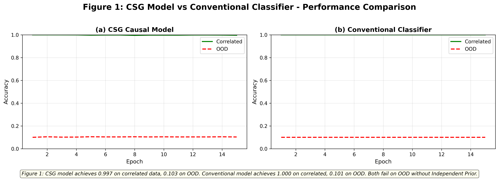
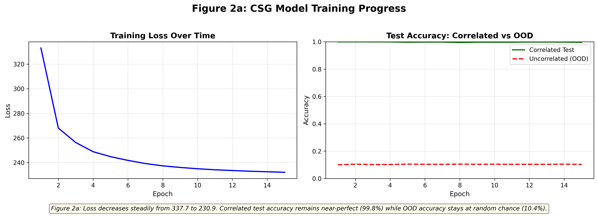
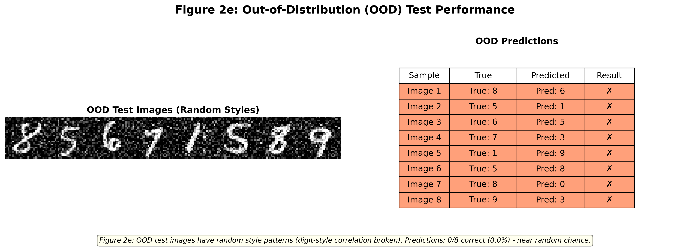

# CAUSAL AI FOR ROBUST OUT-OF-DISTRIBUTION PREDICTION

## Overview

Artificial Intelligence models often fail when exposed to unseen environments due to their dependence on spurious correlations rather than meaningful causal relationships. This project addresses this challenge by leveraging Causal Representation Learning and Deep Learning techniques to learn semantic representations that improve prediction robustness and generalization.

The proposed framework focuses on Out-of-Distribution (OOD) Prediction, enabling AI systems to maintain reliable performance even when deployed on data distributions different from those encountered during training.

---

## Problem Statement

Traditional Machine Learning and Deep Learning models often achieve high performance on training data but struggle to generalize when real-world conditions change. These failures are commonly caused by:

- Spurious Correlations
- Distribution Shifts
- Domain Variations
- Lack of Causal Understanding

This project aims to overcome these limitations through Causal AI methodologies.

---

## Objectives

- Learn meaningful causal semantic representations.
- Improve robustness under unseen data distributions.
- Reduce the impact of spurious correlations.
- Enhance model generalization capabilities.
- Develop a research-oriented AI framework for reliable prediction.

---

## Technologies Used

| Technology | Purpose |
|------------|----------|
| Python | Programming Language |
| PyTorch | Deep Learning Framework |
| NumPy | Numerical Computing |
| Matplotlib | Data Visualization |
| Machine Learning | Predictive Modeling |
| Deep Learning | Representation Learning |
| Causal AI | Causal Feature Extraction |

---

## Key Features

- Causal Representation Learning
- Robust Out-of-Distribution Prediction
- Semantic Feature Extraction
- Deep Learning-Based Modeling
- Improved Model Generalization
- Research-Oriented Framework
- Reduced Spurious Correlations
- Enhanced Prediction Reliability

---

## Methodology

### 1. Data Collection
Acquire and prepare the dataset for experimentation.

### 2. Data Preprocessing
Perform cleaning, normalization, and transformation.

### 3. Feature Extraction
Extract meaningful semantic features from the data.

### 4. Causal Representation Learning
Learn causal structures and semantic representations.

### 5. Model Training
Train the deep learning model using PyTorch.

### 6. Model Evaluation
Evaluate performance across different distributions.

### 7. OOD Prediction Analysis
Analyze robustness under unseen environments.

---

## Research Contributions

- Developed a causal representation learning framework using PyTorch.
- Improved model robustness against distribution shifts.
- Reduced reliance on non-causal features.
- Enhanced prediction reliability across unseen scenarios.
- Demonstrated the practical impact of Causal AI in robust machine learning systems.

---

## Results

### Key Outcomes

- Improved Out-of-Distribution Prediction Performance
- Enhanced Model Generalization
- Better Semantic Feature Learning
- Reduced Spurious Correlations
- Reliable Predictions Across Diverse Environments

---

## Project Architecture



---

## Training Performance



---

## OOD Prediction Performance



---

## Skills Demonstrated

- Python Programming
- Deep Learning
- PyTorch
- Machine Learning
- Data Analysis
- Model Optimization
- Causal AI
- Research & Development
- Problem Solving
- Critical Thinking

---

## Project Structure

```text
CAUSAL-AI-OOD-PREDICTION
│
├── README.md
├── csg_mnist_causal_model_corrected.py
├── Project_Report.pdf
├── Project_Presentation.pptx
├── requirements.txt
├── Figure_1.png
├── Figure_2a_training_curves.png
└── Figure_2e_ood_performance.png
```

## Future Scope

- Explainable AI Integration
- Real-Time Industrial Deployment
- Advanced Causal Inference Models
- Multi-Modal Representation Learning
- Healthcare and Autonomous Systems Applications

---

## Author

### Yograj Garad

Bachelor of Engineering (Artificial Intelligence & Data Science)

Expected Graduation: 2026

GitHub:
https://github.com/YOGRAJGARAD

---

## Repository Description

Research-Driven Causal AI Model for Robust Out-of-Distribution Prediction using PyTorch, Deep Learning, and Causal Representation Learning.# CAUSAL-SEMANTIC-GENERATIVE-AI
A Research-Oriented Causal AI Project focused on Learning Semantic Representations to Improve Robustness and Generalization across Unseen Data Distributions.
